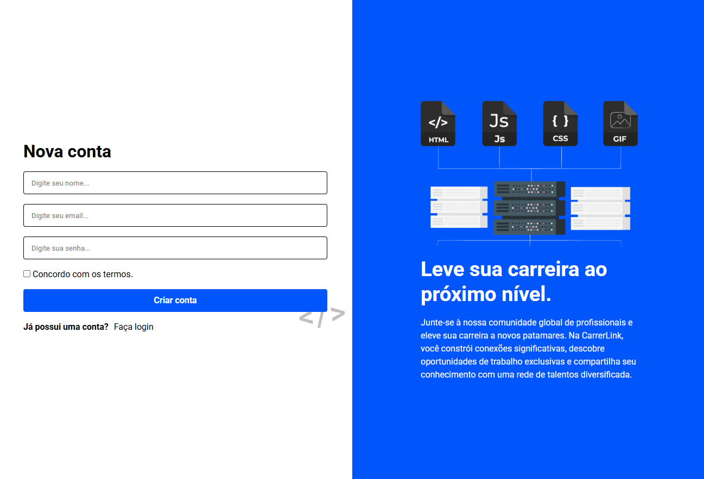
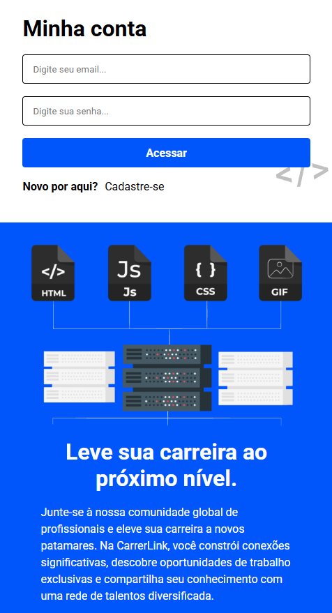

# CarrerLink-login-page
This is a prototype login page made with html and css, which simulates a professional contact network.

- **Flexbox** for responsive layout.
- **Custom Styling**: Uses CSS custom properties for colors, Flexbox for layout, and media queries for responsiveness.

## How to Run
Clone the repository and open `login.html` in a browser.

## Screenshot
### Desktop Screen

### Mobile Screen

